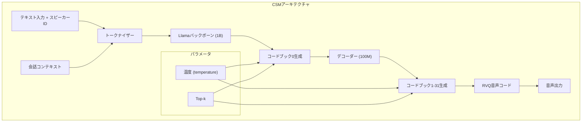

```mermaid
graph TD
    subgraph "CSMアーキテクチャ"
        Input["テキスト入力 + スピーカーID"] --> Tokenizer["トークナイザー"]
        Tokenizer --> Backbone["Llamaバックボーン (1B)"]
        Backbone --> C0["コードブック0生成"]
        C0 --> Decoder["デコーダー (100M)"]
        Decoder --> C1["コードブック1-31生成"]
        C1 --> RVQ["RVQ音声コード"]
        RVQ --> Audio["音声出力"]
        
        Context["会話コンテキスト"] --> Tokenizer
        
        subgraph "パラメータ"
            Temp["温度 (temperature)"]
            TopK["Top-k"]
        end
        
        Temp --> C0
        Temp --> C1
        TopK --> C0
        TopK --> C1
    end
```
