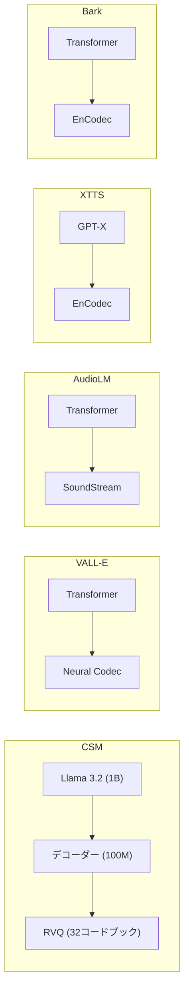

```mermaid
graph LR
    subgraph "CSM"
        CSM_Backbone["Llama 3.2 (1B)"]
        CSM_Decoder["デコーダー (100M)"]
        CSM_Codec["RVQ (32コードブック)"]
        CSM_Backbone --> CSM_Decoder
        CSM_Decoder --> CSM_Codec
    end
    
    subgraph "VALL-E"
        VALLE_Backbone["Transformer"]
        VALLE_Codec["Neural Codec"]
        VALLE_Backbone --> VALLE_Codec
    end
    
    subgraph "AudioLM"
        AudioLM_Backbone["Transformer"]
        AudioLM_Codec["SoundStream"]
        AudioLM_Backbone --> AudioLM_Codec
    end
    
    subgraph "XTTS"
        XTTS_Backbone["GPT-X"]
        XTTS_Codec["EnCodec"]
        XTTS_Backbone --> XTTS_Codec
    end
    
    subgraph "Bark"
        Bark_Backbone["Transformer"]
        Bark_Codec["EnCodec"]
        Bark_Backbone --> Bark_Codec
    end
```
