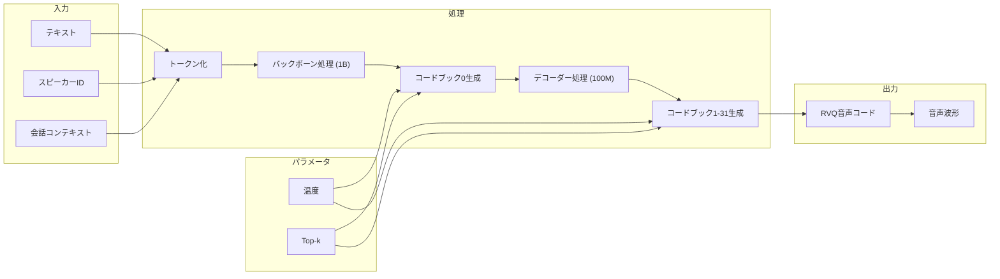

```mermaid
flowchart LR
    subgraph Input["入力"]
        Text["テキスト"]
        Speaker["スピーカーID"]
        Context["会話コンテキスト"]
    end
    
    subgraph Processing["処理"]
        Tokenization["トークン化"]
        BackboneProcessing["バックボーン処理 (1B)"]
        C0Generation["コードブック0生成"]
        DecoderProcessing["デコーダー処理 (100M)"]
        CiGeneration["コードブック1-31生成"]
    end
    
    subgraph Output["出力"]
        RVQCodes["RVQ音声コード"]
        AudioWaveform["音声波形"]
    end
    
    Text --> Tokenization
    Speaker --> Tokenization
    Context --> Tokenization
    
    Tokenization --> BackboneProcessing
    BackboneProcessing --> C0Generation
    C0Generation --> DecoderProcessing
    DecoderProcessing --> CiGeneration
    CiGeneration --> RVQCodes
    RVQCodes --> AudioWaveform
    
    subgraph Parameters["パラメータ"]
        Temperature["温度"]
        TopK["Top-k"]
    end
    
    Temperature --> C0Generation
    Temperature --> CiGeneration
    TopK --> C0Generation
    TopK --> CiGeneration
```
