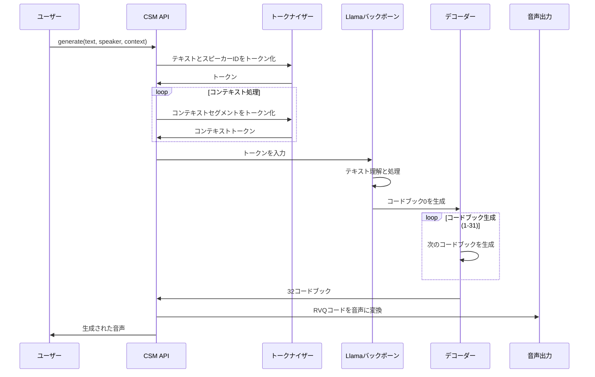

```mermaid
sequenceDiagram
    participant User as ユーザー
    participant API as CSM API
    participant Tokenizer as トークナイザー
    participant Backbone as Llamaバックボーン
    participant Decoder as デコーダー
    participant Audio as 音声出力
    
    User->>API: generate(text, speaker, context)
    API->>Tokenizer: テキストとスピーカーIDをトークン化
    Tokenizer->>API: トークン
    
    loop コンテキスト処理
        API->>Tokenizer: コンテキストセグメントをトークン化
        Tokenizer->>API: コンテキストトークン
    end
    
    API->>Backbone: トークンを入力
    Backbone->>Backbone: テキスト理解と処理
    Backbone->>Decoder: コードブック0を生成
    
    loop コードブック生成 (1-31)
        Decoder->>Decoder: 次のコードブックを生成
    end
    
    Decoder->>API: 32コードブック
    API->>Audio: RVQコードを音声に変換
    API->>User: 生成された音声
```
