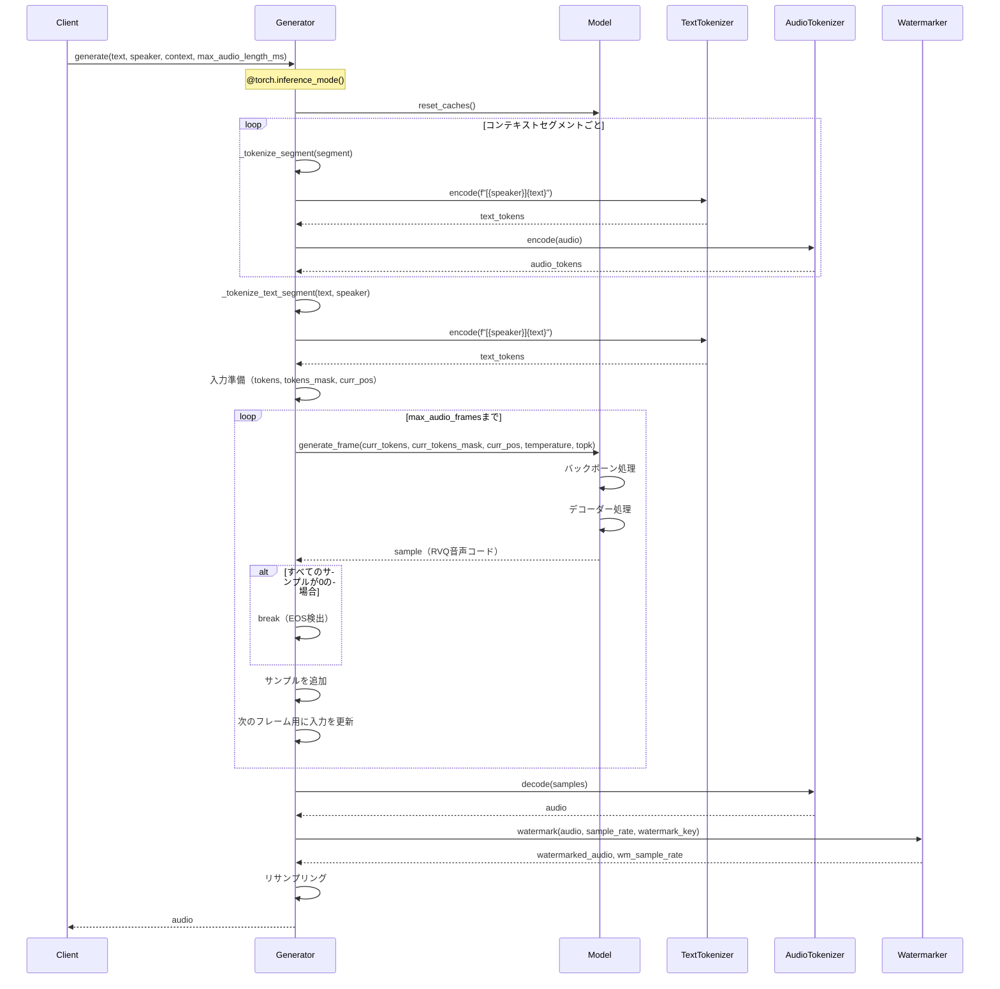
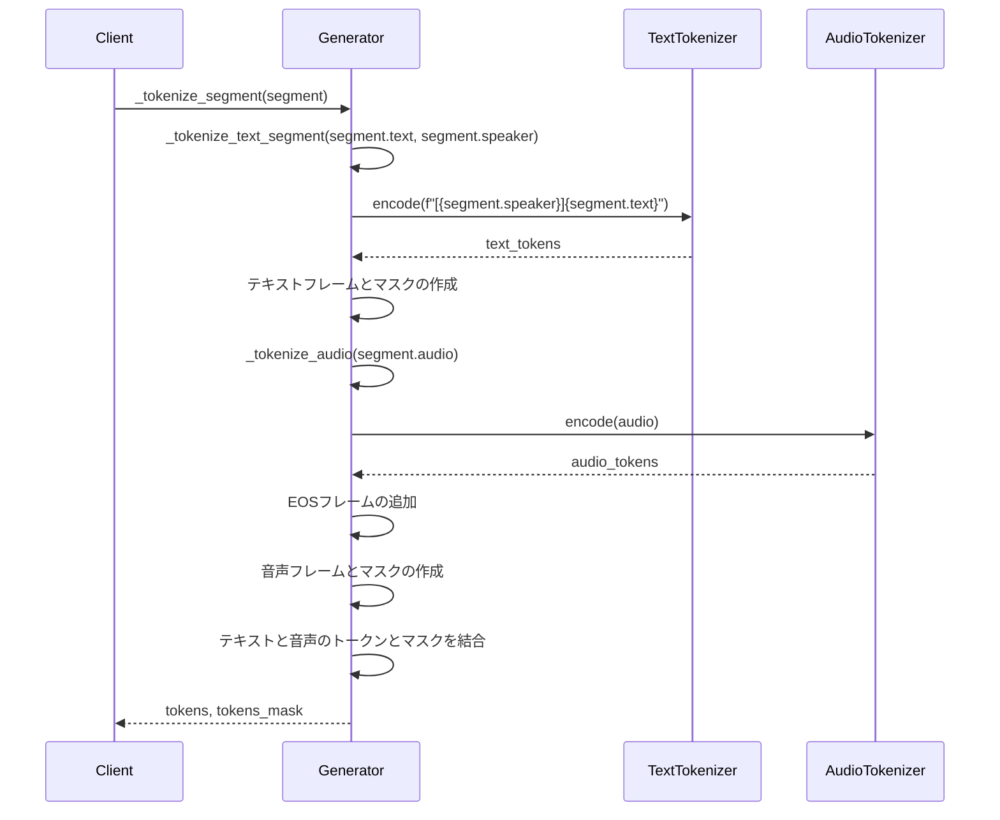
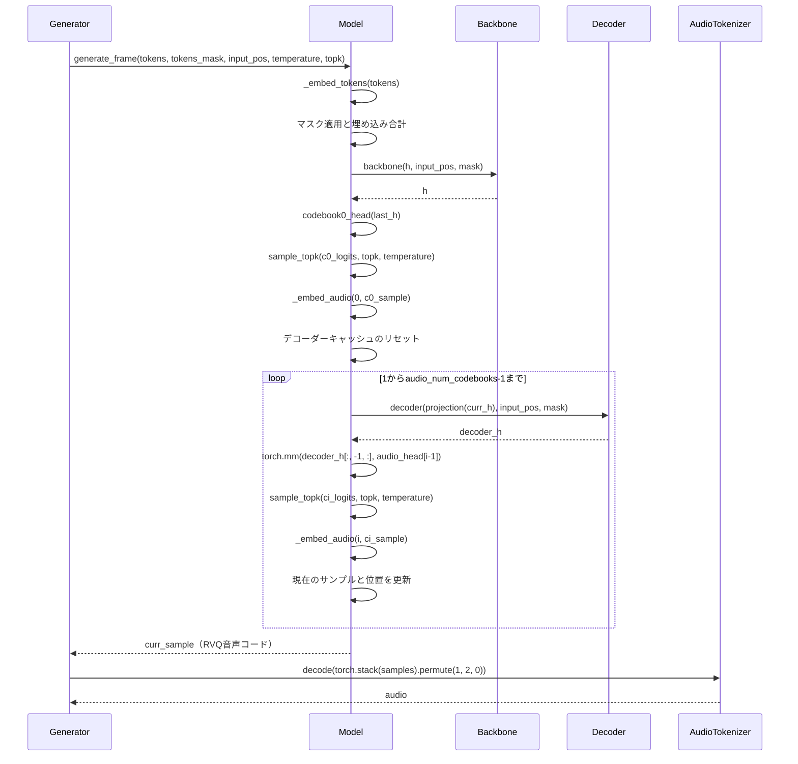
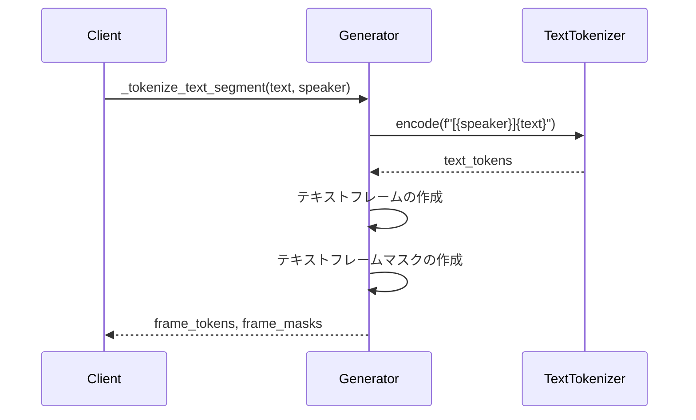
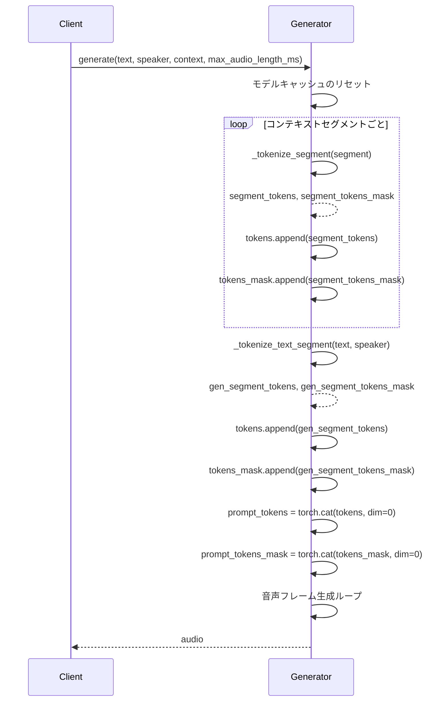
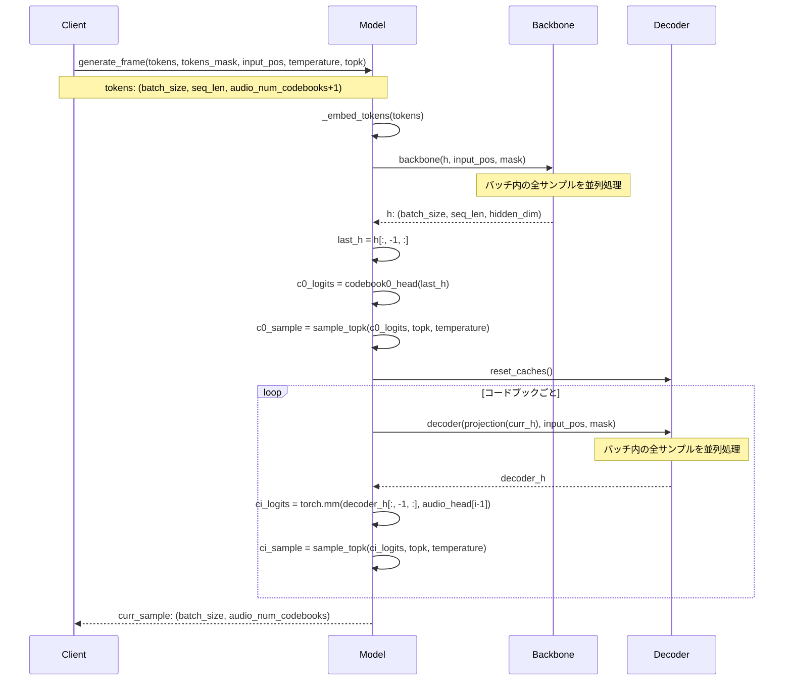
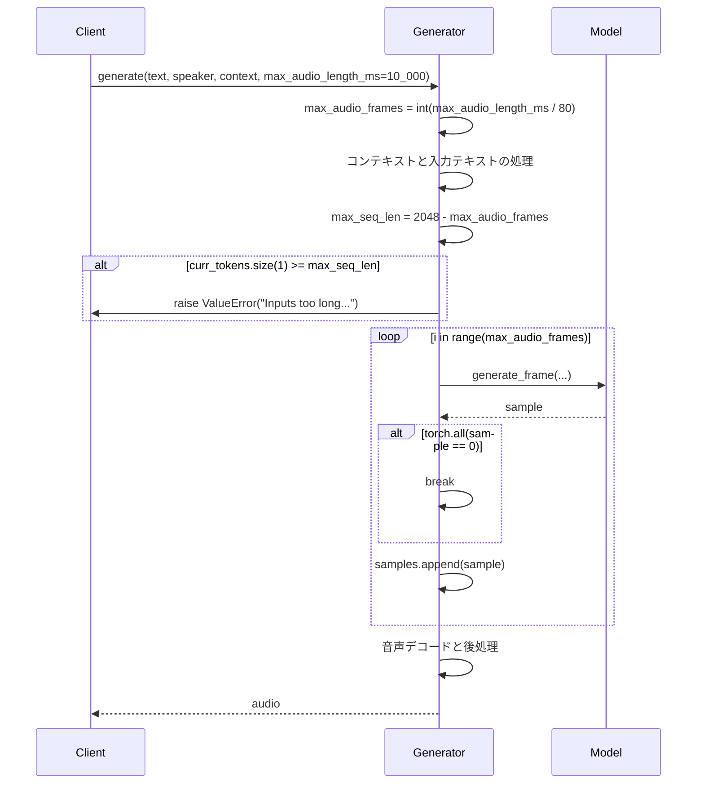
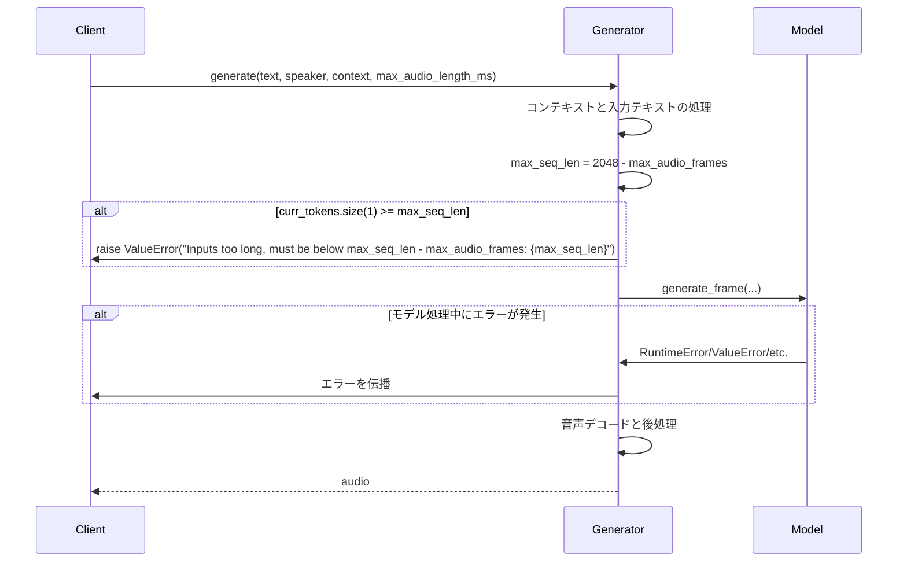
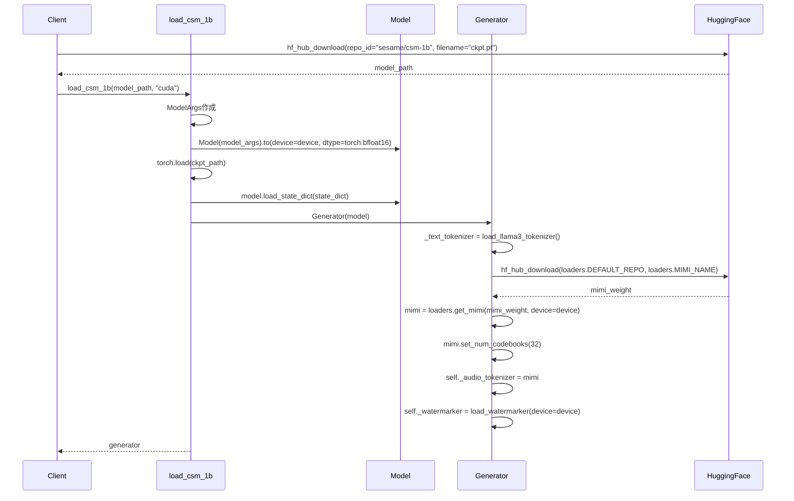
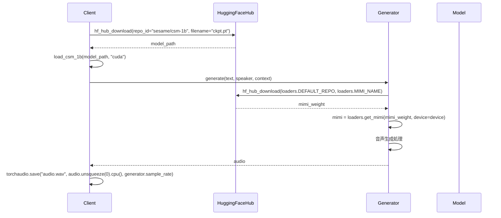

# CSM主要フローのシーケンス図と詳細説明

## 要約

CSM（Conversational Speech Model）の主要フローを理解するため、本ドキュメントではテキスト入力から音声生成までの完全なパイプライン、音声コンテキスト処理、RVQ音声コード生成、スピーカー識別処理など、システムの核となるフローをシーケンス図で説明します。これらの図は、CSMの内部動作メカニズムを視覚的に表現し、各コンポーネント間の相互作用を明確に示しています。また、エラー処理、モデルのロード、Hugging Faceとの連携など、重要な補助フローについても詳細に解説しています。

## テキスト入力から音声生成までの完全なパイプライン

このシーケンス図は、テキスト入力から最終的な音声出力までの完全なパイプラインを示しています。

### 詳細説明

1. **初期化と準備**:
   - クライアントが`generate`メソッドを呼び出し、テキスト、スピーカーID、コンテキスト、最大音声長を指定
   - `@torch.inference_mode()`デコレータにより、推論モードで実行（勾配計算を無効化）
   - モデルのキャッシュをリセット

2. **コンテキスト処理**:
   - 各コンテキストセグメント（過去の会話）をトークン化
   - テキストトークン化と音声トークン化を実行

3. **生成テキストの処理**:
   - 新しく生成するテキストをトークン化

4. **音声コード生成**:
   - 最大フレーム数まで繰り返し
   - モデルの`generate_frame`メソッドを呼び出してRVQ音声コードを生成
   - EOSトークン（すべて0）が検出されたら終了

5. **音声波形生成と後処理**:
   - 生成されたRVQ音声コードを音声波形にデコード
   - 透かしを追加して音声を識別可能に
   - 必要に応じてリサンプリング
   - 最終的な音声をクライアントに返す

## 音声コンテキスト処理と統合フロー

このシーケンス図は、音声コンテキストの処理と統合のフローを示しています。

### 詳細説明

1. **セグメントのトークン化**:
   - `_tokenize_segment`メソッドがセグメント（テキストと音声のペア）を処理
   - テキストと音声を別々にトークン化して後で結合

2. **テキストのトークン化**:
   - スピーカーIDをテキストに埋め込み（`[{speaker}]{text}`形式）
   - テキストトークナイザーでエンコード
   - トークンとマスクを作成

3. **音声のトークン化**:
   - 音声をMimiエンコーダーでRVQ音声コードに変換
   - EOSフレームを追加
   - 音声フレームとマスクを作成

4. **統合**:
   - テキストと音声のトークンとマスクを結合
   - 結合されたトークンとマスクを返す

## RVQ音声コード生成と音声合成プロセス

このシーケンス図は、RVQ（Residual Vector Quantization）音声コードの生成と音声合成のプロセスを示しています。

### 詳細説明

1. **フレーム生成の開始**:
   - `generate_frame`メソッドがトークン、マスク、位置情報を受け取る

2. **トークンの埋め込み**:
   - トークンをモデルの埋め込み空間に変換
   - マスクを適用して有効なトークンのみを処理

3. **バックボーン処理**:
   - Llamaバックボーンでトークンを処理
   - コンテキスト情報を含む隠れ状態を生成

4. **最初のコードブック（c0）の生成**:
   - バックボーンの出力から最初のコードブックのロジットを計算
   - Top-k サンプリングで最初のコードを選択
   - 選択されたコードを埋め込み空間に変換

5. **残りのコードブック（c1〜c31）の生成**:
   - デコーダーキャッシュをリセット
   - 各コードブックを順次生成
   - 前のコードの情報を使って次のコードを生成
   - 各コードを埋め込み空間に変換

6. **音声波形への変換**:
   - 生成されたRVQ音声コードをスタックして整形
   - Mimi音声トークナイザーでデコードして音声波形に変換

## スピーカー識別と処理フロー

このシーケンス図は、スピーカー識別と処理のフローを示しています。

### 詳細説明

1. **スピーカー識別の埋め込み**:
   - テキストの前にスピーカーIDを`[{speaker}]`形式で埋め込む
   - これにより、モデルは異なるスピーカーを区別できる

2. **トークン化**:
   - スピーカーIDを含むテキストをトークン化
   - テキストトークンをフレーム形式に変換

3. **フレームとマスクの作成**:
   - テキストフレームを作成（サイズ: len(text_tokens) x 33）
   - テキストフレームマスクを作成（有効なトークンを示す）
   - 最後の次元（-1）にテキストトークンを配置

4. **結果の返却**:
   - フレームトークンとフレームマスクをクライアントに返す

## マルチターン会話処理の実装フロー

このシーケンス図は、マルチターン会話処理の実装フローを示しています。

### 詳細説明

1. **コンテキスト処理**:
   - 過去の会話セグメント（コンテキスト）を順番に処理
   - 各セグメントをトークン化してリストに追加

2. **生成テキストの処理**:
   - 新しく生成するテキストをトークン化
   - コンテキストトークンのリストに追加

3. **トークンの結合**:
   - すべてのトークンとマスクを時系列順に結合
   - これにより、モデルは過去の会話の流れを考慮できる

4. **音声生成**:
   - 結合されたトークンを使用して音声フレームを生成
   - 生成された音声をクライアントに返す

## バッチ処理と並列計算のシーケンス

このシーケンス図は、バッチ処理と並列計算のシーケンスを示しています。

### 詳細説明

1. **バッチ入力の処理**:
   - モデルは`batch_size`次元を持つ入力を受け取る
   - すべてのサンプルを並列に処理

2. **埋め込みの並列計算**:
   - バッチ内のすべてのトークンを同時に埋め込み空間に変換

3. **バックボーンの並列処理**:
   - Llamaバックボーンがバッチ内のすべてのサンプルを並列に処理
   - 各サンプルの隠れ状態を生成

4. **コードブック生成の並列化**:
   - 最初のコードブック（c0）をバッチ内のすべてのサンプルに対して並列に生成
   - 残りのコードブックも同様に並列処理

5. **デコーダーの並列処理**:
   - デコーダーがバッチ内のすべてのサンプルを並列に処理
   - 各サンプルの次のコードを生成

## 音声長制御とトランケーションメカニズム

このシーケンス図は、音声長制御とトランケーションメカニズムを示しています。

### 詳細説明

1. **最大音声長の設定**:
   - `max_audio_length_ms`パラメータで最大音声長をミリ秒単位で指定
   - 80ミリ秒ごとに1フレームとして、最大フレーム数を計算

2. **入力長のチェック**:
   - モデルの最大シーケンス長（2048）から最大音声フレーム数を引いた値を計算
   - 入力トークンがこの制限を超える場合はエラーを発生

3. **フレーム生成の制御**:
   - 最大フレーム数までループ
   - 各ステップでフレームを生成
   - EOSトークン（すべて0）が検出された場合は早期終了

4. **暗黙的な長さ制御**:
   - モデルは文脈に基づいて適切な長さの音声を生成
   - 最大フレーム数は上限として機能

## エラーハンドリングと例外処理フロー

このシーケンス図は、エラーハンドリングと例外処理のフローを示しています。

### 詳細説明

1. **入力検証**:
   - 入力の長さが制限を超える場合、明示的なエラーメッセージで`ValueError`を発生
   - これにより、ユーザーは問題を理解して修正できる

2. **暗黙的なエラー伝播**:
   - モデル処理中に発生するエラーは、明示的なtry-exceptブロックなしで伝播
   - PyTorchの例外（CUDA関連エラー、メモリ不足など）はそのまま上位に伝播

3. **限定的なエラーハンドリング**:
   - コードベースには包括的なエラーハンドリングは実装されていない
   - 基本的なバリデーションのみが行われている

4. **推測される追加のエラーハンドリング**:
   - 実際の運用環境では、以下のような追加のエラーハンドリングが必要と推測される:
     - CUDA関連エラーの処理
     - メモリ不足エラーの処理
     - 音声処理エラーの処理
     - ネットワークエラーの処理（Hugging Face APIとの通信）

## モデルのロードとチェックポイント処理フロー

このシーケンス図は、モデルのロードとチェックポイント処理のフローを示しています。

### 詳細説明

1. **モデルチェックポイントのダウンロード**:
   - Hugging Faceからモデルチェックポイントをダウンロード
   - `sesame/csm-1b`リポジトリから`ckpt.pt`ファイルを取得

2. **モデルの初期化**:
   - `ModelArgs`を作成してモデルパラメータを設定
   - `Model`クラスのインスタンスを作成
   - デバイス（CUDA）とデータ型（bfloat16）を指定

3. **チェックポイントのロード**:
   - `torch.load`でチェックポイントを読み込み
   - `model.load_state_dict`でモデルの重みを設定

4. **ジェネレーターの初期化**:
   - `Generator`クラスのインスタンスを作成
   - テキストトークナイザーを初期化

5. **Mimiモデルのロード**:
   - Hugging FaceからMimiモデルの重みをダウンロード
   - Mimiモデルを初期化してコードブック数を設定
   - 音声トークナイザーとして設定

6. **透かしモデルの初期化**:
   - 透かしモデルをロード

## Hugging Faceとの連携インターフェースフロー

このシーケンス図は、Hugging Faceとの連携インターフェースのフローを示しています。

### 詳細説明

1. **Hugging Faceからのモデルダウンロード**:
   - `huggingface_hub`ライブラリの`hf_hub_download`関数を使用
   - モデルチェックポイントとMimiモデルの重みをダウンロード

2. **モデルのロードと初期化**:
   - ダウンロードしたチェックポイントからモデルを初期化
   - CUDAデバイスを指定して高速化

3. **音声生成**:
   - 初期化されたジェネレーターを使用して音声を生成
   - テキスト、スピーカーID、コンテキストを指定

4. **結果の保存と共有**:
   - 生成された音声を`torchaudio.save`で保存
   - 必要に応じてHugging Face Spacesなどで共有

5. **Hugging Face Spaces統合**:
   - CSMはHugging Face Spacesでもホストされており、ブラウザから直接試すことが可能
   - https://huggingface.co/spaces/sesame/csm-1b

## 結論

CSMの主要フローのシーケンス図分析から、このモデルが複雑なマルチモーダル処理を行い、テキストと音声の両方を扱う高度なアーキテクチャを持つことが明らかになりました。テキスト入力から音声生成までの完全なパイプライン、RVQ音声コード生成、スピーカー識別処理など、各フローは効率的に設計されています。

特に注目すべき点は、階層的なRVQ音声コード生成メカニズム、マルチターン会話のコンテキスト処理、そしてHugging Faceとの緊密な統合です。これらの要素が組み合わさることで、CSMは高品質な会話型音声生成を実現しています。

また、エラーハンドリングについては比較的シンプルな実装となっており、基本的な入力検証のみが行われています。実運用環境では、より堅牢なエラーハンドリングが必要になると推測されます。
